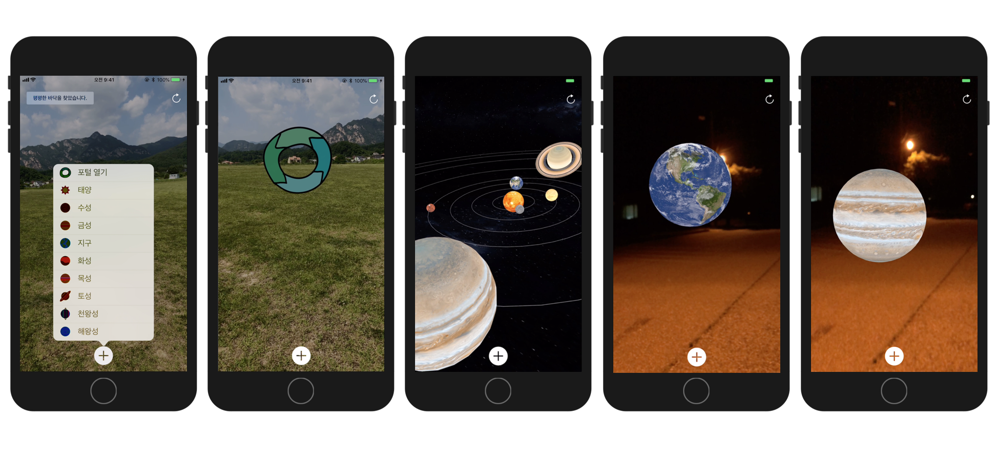

# AR Portal - Solar System 
> ARKit 을 활용한 첫 번째 앱

 

## About this App
이 앱은 AR을 이용하여 우리가 살고 있는 지구를 포함한 태양계의 행성을 관찰하는 앱 입니다.
눈 앞에 태양을 포함한 태양계의 행성들을 하나씩 불러올 수 있습니다.

또한 AR 포털을 열고 들어가 눈 앞에 펼쳐진 환상적인 우주와 태양계의 행성들을 천천히 걸으며 관찰할 수 있습니다.

평평한 바닥이 있는 거실이나 교실, 강당, 야외 등에서 이 앱을 즐겨보세요.

Explore our Solar System including the earth we live in.
You can bring the planets of the solar system in front of you!

You can also open the AR portal and watch the fantastic universe and the planets of the solar system in front of you.

Enjoy this app on a flat floor with living room, classroom, auditorium, or outdoors.

 

## Preview

 

## Update
- ver 1.0 : App Store release (2018. 06. 13)

 

## Contact Info
- **:iphone:** +82 10 5270 0109
- **:email:** jaehyeongee@gmail.com
